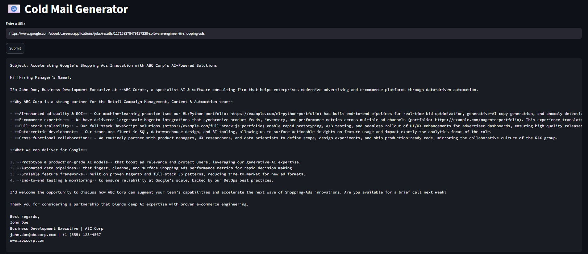

# 📧 Cold Mail Generator

Cold email generator for services company using groq, langchain and streamlit. It allows users to input the URL of a company's careers page. The tool then extracts job listings from that page and generates personalized cold emails. These emails include relevant portfolio links sourced from a vector database, based on the specific job descriptions.

**Imagine a scenario:**

* Google is hiring for a Software Engineer III, Shopping Ads role requiring software development, data analysis, SQL/database querying, and business intelligence experience.

* ABC Corp. is a software development and AI consulting company that can provide engineers with relevant technical skills. John Doe, ABC Corp's BDE, identifies the Google job posting and sends a personalized cold email highlighting the company's capabilities and relevant portfolio projects.



## Architecture Diagram


## Set-up

1. To get started we first need to get an API\_KEY from here: https://console.groq.com/keys. Inside `app/.env` update the value of `GROQ\_API\_KEY` with the API\_KEY you created.


1. To get started, first install the dependencies using:

&#x20;   ```commandline
     pip install -r requirements.txt
    ```

2. Run the streamlit app:

```commandline
   streamlit run app/main.py
   ```

